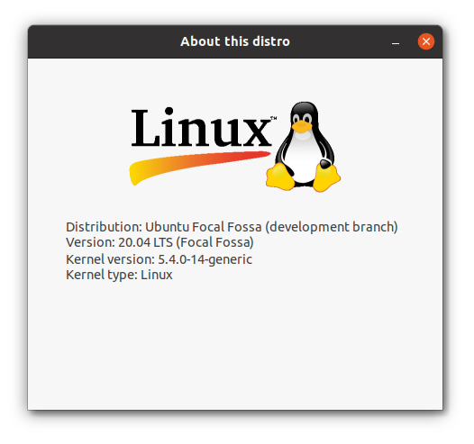

# NIXVER

Nixver is Window's winver like program that shows basic system information. It should work on all unix like operating system such as linux or bsd.
# How to use it
* First, install python and pygobject `sudo apt install python3 python-gobject`
* Next, clone this repo `git clone https://github.com/ptysko/nixver`
* Finally enter to directory `cd nixver` and run program `python3 nixver.py`

# To do
* Display appropriate distribution logo.
* Add more system info.
